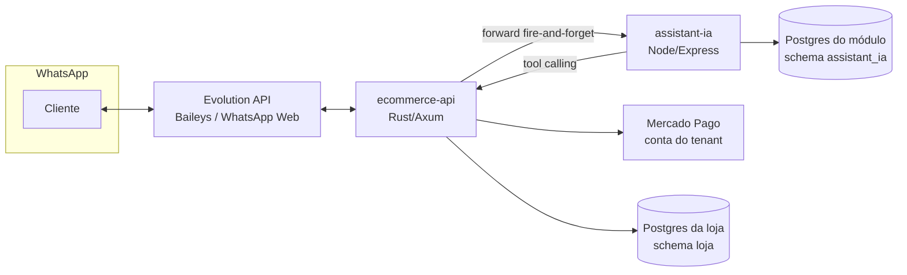
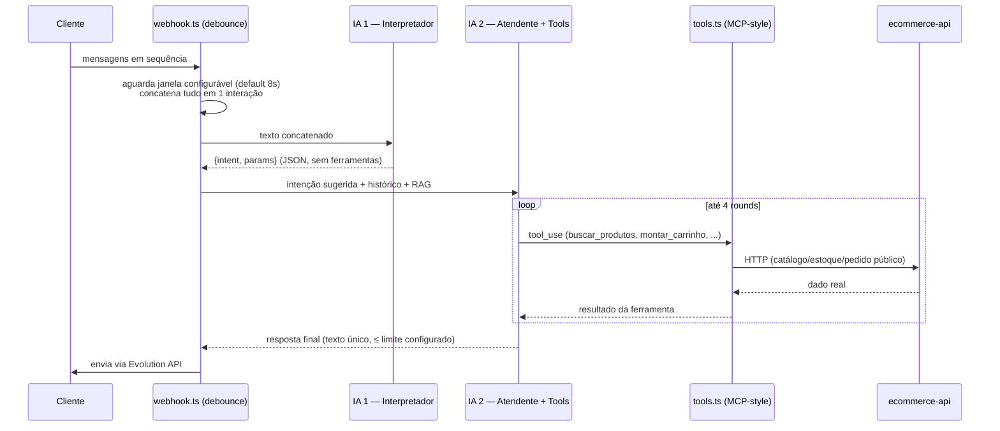

# Assistente IA (a-vrtek-gente) — Arquitetura

Módulo de vendedor/atendente autônomo via WhatsApp para lojas do Resolutoo (SaaS multi-tenant de e-commerce). Repositório isolado, deploy próprio, não altera nada do motor de e-commerce além de um hook de encaminhamento.

## 0. Casos de uso reais (validados em produção)

- Cliente manda "oi" (ou qualquer gatilho configurado) e o assistente inicia o atendimento sozinho, sem lojista online.
- Cliente pergunta "vocês têm capinha pra iPhone 12?" e recebe preço, descrição e link real do catálogo, na hora.
- Cliente descreve o problema ("caiu no vaso", "tela quebrada") e o assistente identifica o serviço certo, com preço real (ou explica que depende de avaliação).
- Cliente pergunta o preço de um serviço cuja peça está em falta no estoque — o assistente sabe que está indisponível e avisa, sem prometer o que não pode entregar.
- Cliente decide comprar um produto — o assistente monta e envia a prévia do carrinho (nome + link + foto) antes de qualquer cobrança.
- Cliente monta um carrinho misto (produto + serviço) na mesma conversa — o assistente cria um único pedido com os dois.
- Cliente confirma a prévia, informa nome e email, escolhe Pix — o assistente gera e envia o código Pix copia-e-cola **real**, emitido pela conta Mercado Pago do próprio lojista.
- Cliente escolhe pagar no cartão — o assistente gera um link de pagamento hospedado real, também via Mercado Pago do tenant.
- Cliente pede entrega do produto (ou coleta do aparelho pra reparo) — o assistente pede a localização fixa pelo próprio WhatsApp antes de fechar a cobrança.
- Cliente pergunta se a loja está aberta agora — o assistente responde com o horário real e se está fechada manualmente (feriado, etc).
- Cliente pergunta o status de um pedido anterior — o assistente consulta pelo telefone da própria conversa e responde com o estado real.
- Cliente manda 4 mensagens seguidas rapidamente — o assistente espera, junta tudo numa interpretação só, e responde uma única vez (não trava em respostas picadas).
- Cliente manda uma mensagem solta sem ter iniciado atendimento — o assistente ignora, não interage com quem não chamou.
- Alguém marca o número da loja num grupo do WhatsApp — o assistente nunca responde, sob nenhuma circunstância.
- Lojista quer interromper a IA numa conversa específica pra assumir manualmente — um toggle no painel tira a IA da jogada sem perder o histórico.
- Lojista quer trocar o "tom de voz"/regras de negócio do assistente sem mexer em código — edita os prompts direto na tela de configuração.
- Crédito da chave de IA da plataforma acaba — lojista cola a própria chave (Anthropic ou OpenRouter) e a loja volta a funcionar sem depender da plataforma.

## 1. Visão geral

O Assistente IA se conecta ao WhatsApp já usado pela loja (via Evolution API, a mesma instância do checkout/motoboy) e conduz o atendimento do início ao fim: entende o que o cliente quer, consulta catálogo/estoque/serviços reais, monta carrinho, confirma dados, e **gera cobrança de verdade** (Pix ou link de cartão) através da conta Mercado Pago conectada pelo próprio lojista — sem intervenção humana, salvo os casos em que ele explicitamente escala pra um atendente.

## 2. Stack técnica

| Camada | Tecnologia |
|---|---|
| Backend do módulo | Node.js + TypeScript + Express |
| Motor de IA | Anthropic Claude (`claude-opus-5`) via `@anthropic-ai/sdk`, **ou** OpenRouter (qualquer modelo com function calling) — escolha por tenant |
| Banco do módulo | Postgres próprio (Railway), schema `assistant_ia` — conversas, mensagens, config, decisões dos agentes, RAG |
| Motor de e-commerce | Rust + Axum (`ecommerce-api`, repo `ufersin`) — catálogo, pedidos, estoque, pagamento |
| Banco da loja | Postgres (Supabase), schema `loja` — produtos, serviços, pedidos, clientes |
| WhatsApp | Evolution API (Baileys) — mesma instância que a loja já usa pro checkout |
| Pagamento Pix / link de cartão | Mercado Pago, via OAuth conectado pelo próprio lojista (`plataforma_credenciais` na tabela `tenants`) |
| Deploy | Railway (dois serviços independentes: `assistant-ia` e `ecommerce-api`) |
| Frontend de configuração | React/Vite, aba "Assistente IA" em `/meu-plano/assistente-ia` (plataforma Rodoletas/Resolutoo) |
| Frontend de inbox | React/Vite, `/admin/chat` (painel da loja) |

## 3. Pipeline de decisão — 2 camadas

- **IA 1 (Interpretador)**: lê a mensagem (já concatenada, se veio em sequência) e decide a intenção — não responde ao cliente, não tem ferramentas. Saída: JSON `{intent, params}`.
- **IA 2 (Atendente)**: reavalia a intenção de forma independente, decide se precisa buscar dado real (chama as tools), e ela mesma já formula a resposta final que vai pro WhatsApp. Não existe uma terceira camada "supervisora" separada — colapsado propositalmente pra reduzir latência e custo sem perder a dupla checagem de intenção.
- Cada resposta final é gravada em `agent_decisions` (uma linha por camada, JSON) — auditável por conversa.

### Regras universais vs. prompt do lojista

Hardcoded no backend (`pipeline.ts::universalValidatorRules`), **não editável pela tela de configuração**:
- nunca gerar cobrança sem antes mostrar a prévia do carrinho e ter confirmação explícita do cliente;
- nunca chamar a tool de cobrança sem nome + email + método de pagamento (e localização, se for entrega/coleta);
- nunca inventar preço, id, link, código Pix ou status de pedido — só repetir o que uma tool retornou de verdade nesta mesma interação;
- resposta final sempre em **uma única mensagem**, dentro do limite de caracteres configurado (evita a IA despejar textões em vários balões).

Editável por tenant em `/meu-plano/assistente-ia` (`prompt_interpreter`, `prompt_validator`): tom de voz, contexto de negócio, regras específicas do ramo (ex: "sempre pergunte marca/modelo antes de orçar reparo").

## 4. Debounce de mensagens em sequência

Cliente digitando várias mensagens seguidas (comportamento normal de WhatsApp) não deve gerar uma resposta por mensagem. `webhook.ts` mantém um `Map<conversationId, PendingBatch>` em memória: cada mensagem nova reseta um `setTimeout` (janela configurável por tenant, `message_batch_window_seconds`, default 8s). Quando o timer estoura, todas as mensagens acumuladas são concatenadas (`\n`) e processadas como **uma única interação** pelo pipeline. Only-in-memory — se o serviço escalar horizontalmente, isso precisa virar Redis/sticky routing (documentado como próximo passo, ainda não necessário no volume atual).

Fila de decisão: `cliente interage N vezes → 1 interação processada → 1 resposta enviada`, nunca N respostas.

## 5. Ferramentas (estilo MCP)

Cada uma é um adapter fino pra um endpoint público do `ecommerce-api` — o módulo **nunca acessa o banco da loja diretamente**, só via HTTP. Desenhado pra virar um servidor MCP de verdade depois (uma tool por capacidade); hoje são funções TypeScript chamadas via tool use da Anthropic/OpenRouter, mesmo contrato de entrada/saída.

| Tool | O que faz |
|---|---|
| `buscar_produtos` | Catálogo real (id, nome, preço, descrição, link público, foto) |
| `buscar_servicos` | Serviços reais (reparo/manutenção) — preço, categoria, **disponibilidade calculada pelo estoque de peça ligada** |
| `consultar_horario_funcionamento` | Horário real + status manual (aberto/fechado) |
| `consultar_localizacao_loja` | Endereço de retirada cadastrado |
| `consultar_pedido` | Pedidos recentes do cliente, pelo telefone da própria conversa |
| `montar_carrinho` | Monta a **prévia** do carrinho (nome + link + foto) — nunca cria pedido nem cobra, só formata pra confirmação do cliente |
| `criar_pedido_e_gerar_cobranca` | Cria o pedido de verdade (produto e/ou serviço, misto inclusive) e gera Pix ou link de cartão via Mercado Pago do tenant |

`executeTool(name, input, ctx)` é o único ponto de execução — `ctx` carrega `tenantSlug`, `phone`, `customerName` (nunca credenciais).

## 6. Checkout: produto, serviço, ou os dois juntos

`criar_pedido_e_gerar_cobranca` aceita uma lista de itens onde cada um tem **ou** `produto_id` **ou** `servico_id` — o mesmo pedido pode misturar os dois (ex: "capinha + troca de tela"). No lado do `ecommerce-api`:

- Item de produto: valida estoque/ativo, usa `products.price`.
- Item de serviço: valida se está ativo e se tem **disponibilidade calculada** (quando o serviço depende de uma peça de estoque — ex: "Troca de Tela iPhone 12" consome 1x "Tela iPhone 12"). Sem peça suficiente, a criação do pedido falha e a IA avisa o cliente.
- `order_items.product_id` é reaproveitado como id opaco pros dois casos (produto real ou serviço) — nenhum código existente que lê essa tabela precisou mudar, porque nunca faz JOIN assumindo que é sempre um produto.
- Ao confirmar pagamento, o consumo de estoque (`orders_common::decrement_stock_for_order`) decrementa tanto ingredientes de produto formulado (ERP) quanto de peça ligada a serviço, via uma única query `UNION ALL` (`formulation.rs`).

### Fluxo de checkout completo

1. Cliente confirma o que quer comprar → IA chama `montar_carrinho` → manda prévia (nome + link + foto) → **espera confirmação explícita**.
2. IA pergunta se quer entrega (produto) ou coleta+entrega (serviço de reparo). Se sim, pede pra compartilhar **localização fixa** no próprio WhatsApp (não aceita endereço só em texto).
3. IA coleta nome completo + email + método de pagamento (pix ou link de cartão).
4. Só com tudo isso, chama `criar_pedido_e_gerar_cobranca` → cria o pedido (`POST /api/public/catalog/{slug}/assistant-order`) → gera a cobrança:
   - **Pix**: `POST /api/orders/{id}/create-pix-payment?customer_email=...` → Mercado Pago do tenant gera QR/copia-e-cola real, síncrono, na mesma requisição.
   - **Cartão**: pedido nasce com `payment_method='cartao'` → `POST /api/orders/{id}/card-link` → Mercado Pago gera link de pagamento hospedado.
5. A resposta da tool já contém o código/link real — a IA repassa **literalmente**, nunca reformula (regra universal, evita alucinação de código de pagamento).

## 7. Pagamento — Mercado Pago (OAuth do tenant)

Cada loja conecta sua **própria** conta Mercado Pago (fluxo OAuth padrão, `client_id`/`client_secret`/`redirect_uri` da aplicação Resolutoo, token do tenant salvo em `tenants.plataforma_credenciais` como JSONB). O Assistente IA nunca lida com credenciais de pagamento diretamente — só chama os endpoints públicos do `ecommerce-api`, que resolve qual provedor usar por tenant (`tenant::load_tenant_payment` → `TenantPayment::online_provider()`):

- `"mercado_pago"` com token válido → Pix/link via Mercado Pago (produção real).
- Sem token → cai em modo mock/Abacate Pay (usado só em ambiente de teste sem conta conectada).

## 8. Localização (entrega/coleta) via WhatsApp

Evolution API entrega mensagens de localização como `locationMessage`/`liveLocationMessage` (lat/lng), tipo de payload diferente de texto normal. O forward Rust (`webhooks.rs::forward_to_assistant_ia`) detecta esse tipo e converte pra um link do Google Maps embutido como texto (`[Cliente compartilhou localização fixa: https://maps.google.com/?q=lat,lng]`), que entra na conversa como qualquer outra mensagem — a IA lê isso no histórico e usa como confirmação de endereço antes de fechar um pedido com entrega/coleta.

## 9. Debounce, filtro de grupo e gatilho de início

- **Grupos do WhatsApp nunca recebem resposta** — filtrado no forward (`remoteJid` terminando em `@g.us`), antes mesmo de chegar no módulo de IA.
- **Só responde quem iniciou o atendimento**: sem uma conversa já aberta (dentro da janela de `window_timeout_minutes`), a mensagem só abre atendimento se bater um dos `start_keywords` configurados pelo tenant. Mensagem solta de quem nunca iniciou é ignorada por completo — não cria conversa, não responde.
- **Encerramento**: `end_keywords` fecha a janela ativa (nenhuma resposta automática depois disso, fica esperando atendimento humano).

## 10. Multi-provedor de IA

`aiClient.ts` abstrai o motor de IA por trás de uma única assinatura (`completeWithTools`, `completeSimple`), assim `pipeline.ts` nunca sabe qual provedor está em uso:

- **Anthropic** (padrão): `@anthropic-ai/sdk`, tool calling nativo (`tool_use`/`tool_result`).
- **OpenRouter**: `fetch` direto pro endpoint `chat/completions` (formato compatível com OpenAI), tools convertidas de `input_schema` (Anthropic) pra `parameters` (OpenAI function calling), qualquer modelo com suporte a function calling disponível na OpenRouter.

Cada tenant escolhe o provedor e cola sua própria chave em `/meu-plano/assistente-ia` — sem chave própria, usa a `ANTHROPIC_API_KEY` global da plataforma (fallback).

## 11. Banco do módulo (`assistant_ia` schema)

| Tabela | Papel |
|---|---|
| `assistant_config` | 1 linha por tenant — prompts, keywords, janela de timeout/debounce, limites de resposta, provedor/modelo/chave de IA |
| `conversations` | Janela de atendimento (telefone, status, `assistant_enabled`, `human_override`) |
| `messages` | Histórico completo (inbound/outbound, `sender_type`) |
| `agent_decisions` | Saída JSON de cada camada, por mensagem — auditoria |
| `rag_documents` / `rag_chunks` | Base de conhecimento própria por tenant (upload de arquivo → chunking → full-text search Postgres `tsvector`) |

## 12. Inbox humano (`/admin/chat`)

Painel do lojista pra acompanhar (e assumir) qualquer conversa em tempo quase real — polling de 3s (conversas + mensagens da conversa aberta). Toggle "Interromper Assistente IA" por conversa (`human_override`) tira a IA da jogada sem perder o histórico, pro humano assumir manualmente.

## 13. O que NÃO está implementado (limites honestos)

- Fila assíncrona (Redis) pra geração de cobrança — **desnecessária**: a chamada ao Mercado Pago é síncrona, o Pix/link volta na mesma requisição, dentro do mesmo turno da conversa.
- Endereço de entrega estruturado no pedido (rua/número/CEP) — hoje só a localização compartilhada fica registrada na conversa; a logística de entrega/coleta em si é combinada por um atendente humano após o pagamento confirmado.
- Debounce distribuído (múltiplas instâncias do serviço) — hoje é em memória, válido pro volume atual; documentado como trabalho futuro se o serviço escalar horizontalmente.
